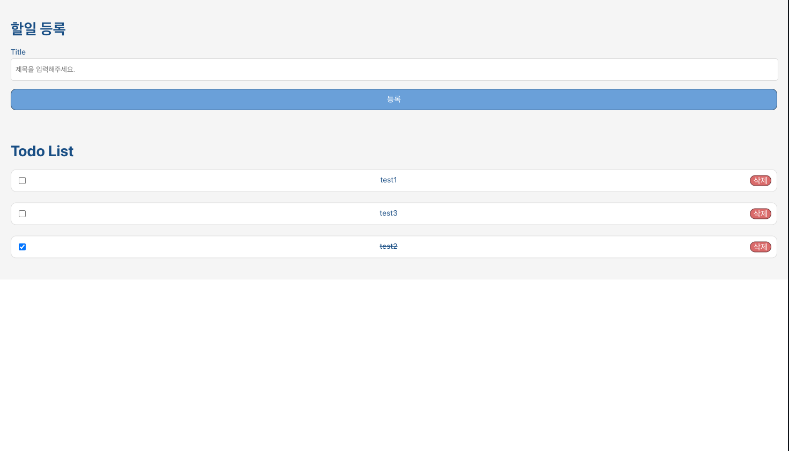

# 프로젝트 실행 방법

## 실행 환경

- nodejs: 18.7.0
- npm: 8.15.0
- yarn: 1.22.19
- 웹 브라우저: chrome 107.0.5304.121

## 설치

- yarn 설치

```sh
npm install -g yarn@1.22.19
```

- 패키지 설치

```sh
yarn install
```

## 실행

`yarn start`실행 후, 웹 브라우저에서 localhost:3000로 실행 결과물을 확인

```sh
yarn start
```

# 최종 스크린샷



# 사용한 기술과 선택한 이유

> CRA(create-react-app) : 가장 빠르게 react 환경을 구축할 수 있음

## 프로젝트 구조

- components : 반복되는 요소 분리하여 구성

```bash
├── public
├── src
│   ├── components
├── .eslintrc
├── .gitignore
├── .prettierrc
├── package.json
├── README.md
└── yarn.lock
```
